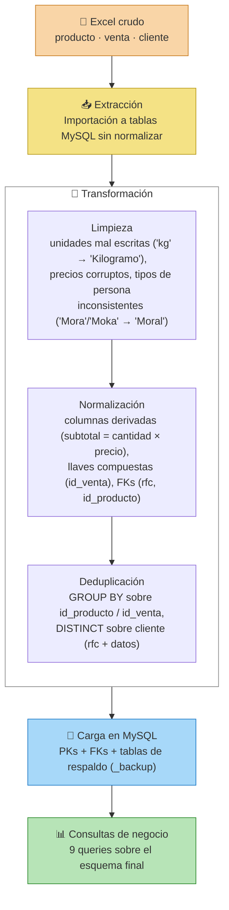
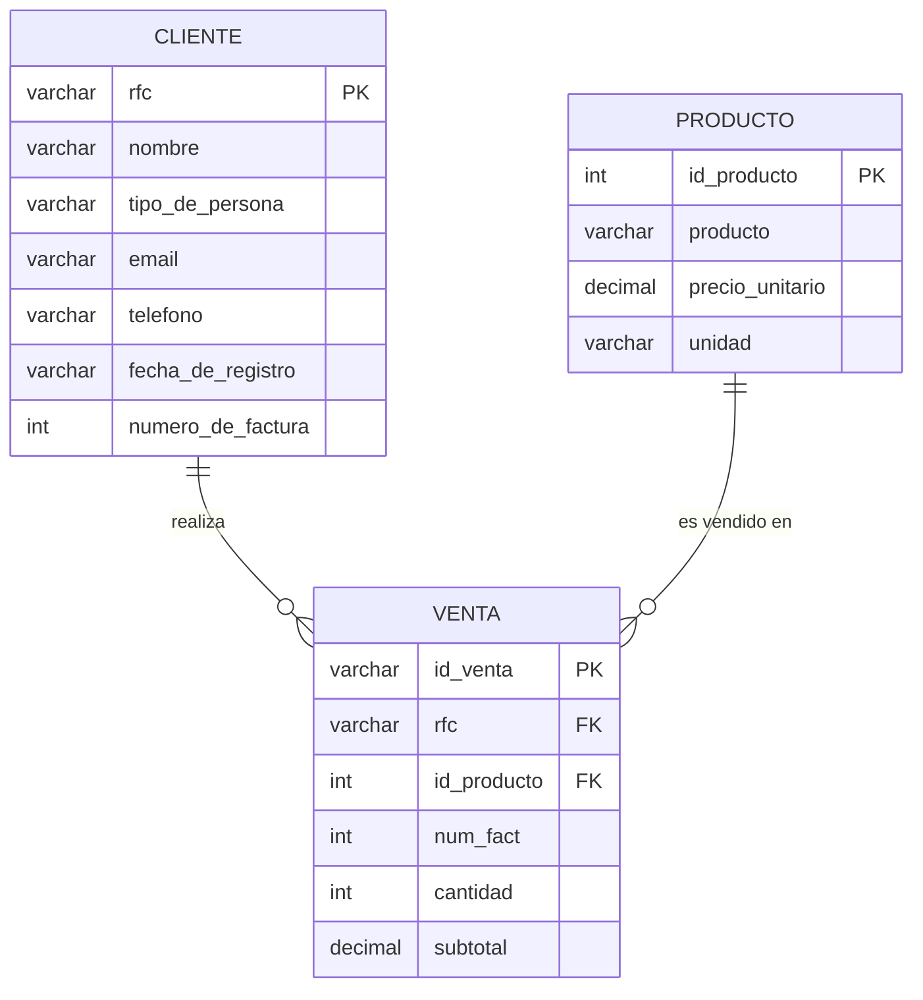
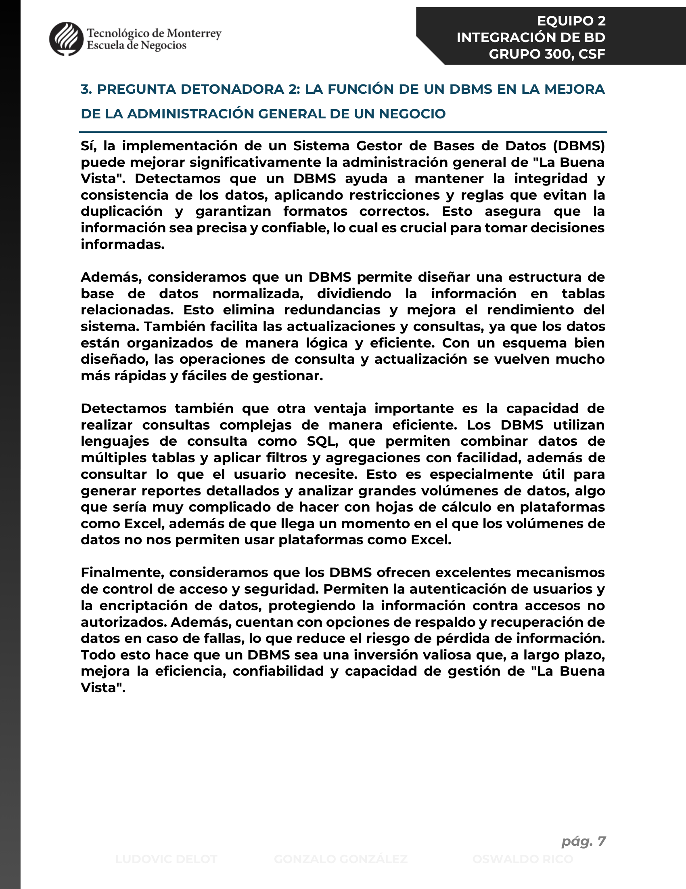
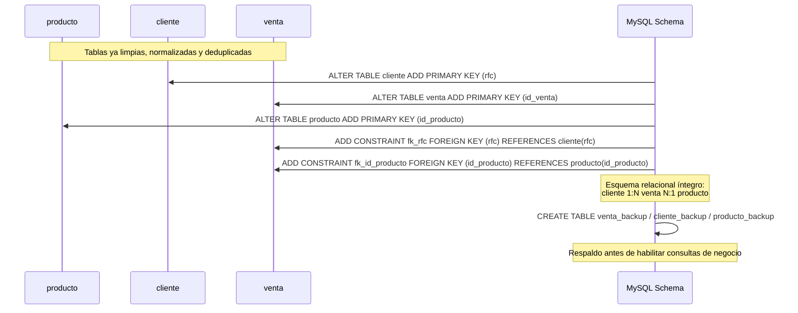

# La Buena Vista — Migración de Excel a MySQL (ETL + SQL)

Trabajo académico del curso **Integración de Bases de Datos (TI2017.300)**,
Licenciatura en Innovación y Tecnología (LIT), **Tecnológico de Monterrey**,
Escuela de Negocios — Campus Culiacán (CSF), Semestre 4 (S4).

Este repositorio documenta el proceso completo de migrar el control de ventas
de una microempresa desde hojas de cálculo de Excel hacia una base de datos
relacional en **MySQL**: modelado entidad-relación, ETL (extracción,
transformación y carga) de datos crudos e inconsistentes, y consultas SQL
que responden preguntas de negocio reales.

## 📑 Tabla de contenido

- [Contexto del reto](#-contexto-del-reto)
- [Proceso ETL](#-proceso-etl)
- [Modelo entidad-relación](#-modelo-entidad-relación)
- [Scripts incluidos](#-scripts-incluidos)
- [Consultas de negocio](#-consultas-de-negocio)
- [Herramienta](#-herramienta)
- [Cómo usarlo](#-cómo-usarlo)
- [Estructura del repo](#-estructura-del-repo)
- [Notas sobre los datos](#-notas-sobre-los-datos)
- [Autoría](#-autoría)

## 🎯 Contexto del reto

"La Buena Vista" es una microempresa ficticia que vende productos de higiene
industrial. El negocio administraba sus ventas en hojas de cálculo de Excel,
lo que generaba inconsistencias de captura, duplicados y limitaba cualquier
análisis. El reto consistió en **migrar ese modelo a una base de datos
relacional en MySQL**: diseñar el modelo entidad-relación, construir el
esquema, hacer el proceso ETL (extracción, transformación y carga) sobre los
datos crudos de Excel, y construir consultas SQL que respondieran preguntas
de negocio reales.

## 🔄 Proceso ETL

Flujo seguido para pasar de las hojas de Excel crudas al esquema relacional
final en MySQL, tal como está implementado en
[`sql/02_team_master_script.sql`](sql/02_team_master_script.sql):



Pasos clave ejecutados en el script maestro:

- **Producto**: deduplicación por `id_producto`, corrección de unidades de
  medida mal capturadas, corrección de un precio corrupto
  (`73000000` → `73`), eliminación de un registro erróneo y corrección de
  nombres de producto.
- **Venta**: adición de la FK `rfc` (vía `JOIN` con `cliente` sobre
  `numero_de_factura`), eliminación de la columna redundante
  `precio_unitario`, cálculo de la columna derivada `subtotal`, generación
  de la llave primaria compuesta `id_venta` (`num_fact-id_producto`) y
  deduplicación por `id_venta`.
- **Cliente**: eliminación de registros sin número de factura, normalización
  de `tipo_de_persona` (variantes como `Mora`, `Moka`, `Morra` → `Moral`;
  `Fisica`, `Físika` → `Física`), relleno de correos vacíos con valor
  *dummy*, y deduplicación con `DISTINCT`/`GROUP BY` sobre `rfc`.
- **Integridad referencial**: alta de `PRIMARY KEY` en las tres tablas
  (`cliente.rfc`, `venta.id_venta`, `producto.id_producto`) y de las
  `FOREIGN KEY` de `venta` hacia `cliente` y `producto`.
- **Respaldo**: creación de `venta_backup`, `cliente_backup` y
  `producto_backup` antes de dejar el esquema en su versión final.

## 🗂️ Modelo entidad-relación

El modelo final quedó compuesto por tres entidades:

- **`cliente`** (PK `rfc`): nombre, tipo de persona (Física/Moral), email,
  teléfono, fecha de registro.
- **`producto`** (PK `id_producto`): nombre del producto, precio unitario,
  unidad de medida.
- **`venta`** (PK `id_venta`, FK `rfc` → cliente, FK `id_producto` →
  producto): número de factura, cantidad, subtotal.

Relaciones: `cliente` 1:N `venta`, y `venta` N:1 `producto` (cada venta
pertenece a un solo cliente y a un solo producto; un cliente o un producto
pueden aparecer en muchas ventas).



> El diagrama Mermaid de arriba es la versión de referencia editable del
> modelo. Se conserva además la imagen original, generada por *reverse
> engineering* del esquema en MySQL Workbench, como referencia visual
> complementaria:



*Diagrama tomado del reporte final del equipo (reverse engineering del
esquema construido en MySQL Workbench).*

### Secuencia de carga e integridad referencial

Orden en el que el script maestro construye las llaves y relaciones finales
sobre las tablas ya limpias, tal como aparece en el bloque `-- JOINS` de
[`sql/02_team_master_script.sql`](sql/02_team_master_script.sql):



## 📜 Scripts incluidos

| Archivo | Descripción |
|---|---|
| [`sql/01_individual_exercise.sql`](sql/01_individual_exercise.sql) | Ejercicio individual de práctica: modelado de dos tablas relacionadas (`Extra_Cliente` / `Extra_Promocion`) con `INNER JOIN` para responder preguntas de negocio simples (clientes con cierta promoción, promociones enviadas en un mes, etc.). |
| [`sql/02_team_master_script.sql`](sql/02_team_master_script.sql) | Script maestro del proyecto de equipo: limpieza y transformación (ETL) de las tres entidades del negocio — `producto`, `venta` y `cliente` — normalización de catálogos, cálculo de columnas derivadas, deduplicación, generación de llaves primarias/foráneas y respaldo de tablas. |

## 📊 Consultas de negocio

Sobre el esquema ya migrado se construyeron consultas SQL para responder
preguntas de negocio reales. Cada una se justificó en el reporte final del
equipo en términos del beneficio que aporta al negocio:

| # | Pregunta de negocio | Insight que responde |
|---|---|---|
| 1 | ¿Cuáles son los 5 productos que más se venden (por cantidad)? | Priorización de inventario y reabastecimiento |
| 2 | ¿Qué productos se venden más según el tipo de cliente (Física vs. Moral)? | Segmentación de catálogo por tipo de comprador |
| 3 | ¿Qué productos generan mayor ingreso promedio por venta? | Identificación de productos de alto margen por ticket |
| 4 | ¿Cuáles son los 5 productos con menos ventas? | Detección de productos de bajo movimiento (candidatos a descontinuar) |
| 5 | ¿Cuáles son las ventas totales (ingresos) por producto? | Contribución de cada producto a los ingresos totales |
| 6 | ¿Cuáles son los 5 clientes que más han comprado? | Identificación de clientes clave para retención |
| 7 | ¿Cuáles son las 5 facturas (tickets) con el monto más alto? | Detección de compras de alto valor |
| 8 | ¿Qué correos de clientes compraron un producto específico? | Segmentación para campañas de marketing dirigidas |
| 9 | ¿Cuáles son los 3 productos más caros del catálogo? | Referencia para estrategias de precio y posicionamiento |

## 🛠️ Herramienta

El equipo migró la base de datos a **MySQL Workbench** en lugar de Microsoft
Access, por su capacidad para manejar mayores volúmenes de datos, su
compatibilidad multiplataforma, su lenguaje SQL estándar en la industria y
por ser la herramienta más relevante para el desarrollo profesional en
inteligencia de negocios.

## ▶️ Cómo usarlo

1. Instala **MySQL Server** (8.x recomendado) y, opcionalmente, **MySQL
   Workbench** como cliente gráfico.
2. Crea un esquema para el proyecto:
   ```sql
   CREATE DATABASE la_buena_vista;
   USE la_buena_vista;
   ```
3. Para el ejercicio individual, corre directamente:
   ```bash
   mysql -u <usuario> -p la_buena_vista < sql/01_individual_exercise.sql
   ```
   Este script crea sus propias tablas (`Extra_Cliente`, `Extra_Promocion`)
   desde cero, así que no requiere datos previos.
4. Para el script maestro de equipo, ten en cuenta que **no crea las tablas
   base `producto`, `venta` y `cliente` desde cero** — asume que ya existen
   con datos crudos importados desde Excel (tal como se hizo originalmente
   en el proyecto vía el asistente de importación de MySQL Workbench). Por
   eso el script está pensado para **correrse por bloques/queries, no de
   un solo `SOURCE`**, revisando cada `SELECT` de verificación antes de
   continuar con la siguiente transformación.
5. Al finalizar, el esquema queda con `cliente`, `producto` y `venta`
   enlazadas por llaves primarias y foráneas, más sus respectivos
   `_backup`, listas para correr las consultas de negocio.

## 📁 Estructura del repo

```
bsc-mysql-etl-la-buena-vista/
├── README.md
├── docs/
│   └── modelo_er_la_buena_vista.png   # ER exportado desde MySQL Workbench
└── sql/
    ├── 01_individual_exercise.sql     # Ejercicio individual (Cliente/Promoción)
    └── 02_team_master_script.sql      # ETL completo + consultas de negocio
```

## 🔒 Notas sobre los datos

- Los datos de clientes son sintéticos/de práctica escolar. Los nombres de
  clientes individuales en `sql/02_team_master_script.sql` fueron
  reemplazados por identificadores genéricos (`Cliente Uno`, `Cliente Dos`,
  ...) para no exponer datos personales de compañeros de clase que se
  usaron originalmente como datos de prueba ("dummy data"). La estructura,
  tipos de dato y lógica de transformación del script son las originales
  del ejercicio.
- No se incluyen credenciales de conexión a base de datos en ninguno de los
  dos scripts.

## 👥 Autoría

Proyecto colaborativo desarrollado en equipo (Equipo 2, Grupo 300) para la
materia Integración de Bases de Datos, bajo la supervisión de la profesora
Martha Verónica Legarda Zapien:

- Ludovic Delot Bravo
- Gonzalo González Méndez
- Oswaldo López Rico

`sql/01_individual_exercise.sql` es trabajo individual de Ludovic Delot
Bravo. `sql/02_team_master_script.sql` es el entregable final de equipo.
